# 搜索（查找）
## AVL Trees（实时调控）
1. 
背景：为了快速查找，BST会出现插入时，树的好坏依赖于插入顺序的情况，以此引入AVL树。
2. 
对于好坏的描述：采用Average search time
> height balanced，balance factorBF定义
height balanced：左右字数也height balanced，并且左右子树高度差不超过1
$ BF(node) = h_L-h_R / h_R-h_L$

3. 
判断怎么转的时候只看三层（是从出现问题的那个节点开始往下算的）
#### RR rotation（LL rotation同理）
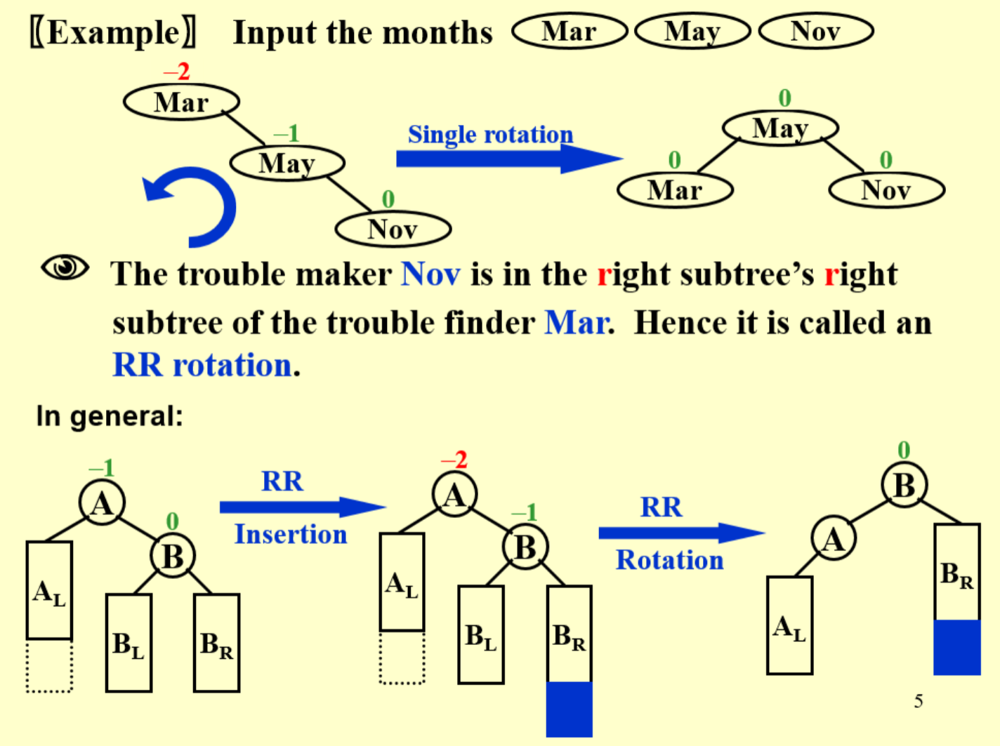
基础方法：向右下两个出现2，将中间的转到上面
总体方法：如果这个新根(B)，有左子树的话，挂到原来的根(A)的右侧。
#### LR rotation
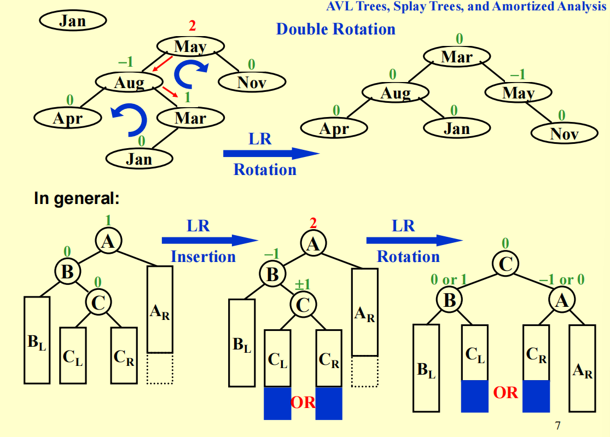
基础/总体方法：将最下面的那个结点(Mar)变成看的最上面的那个，原来的向右边走。原来的下面的结点(Mar)直接挂在第二层的下面。小的在左边，大的在右边。（要换挂的节点就换下面挂着的那个）
#### RL rotation
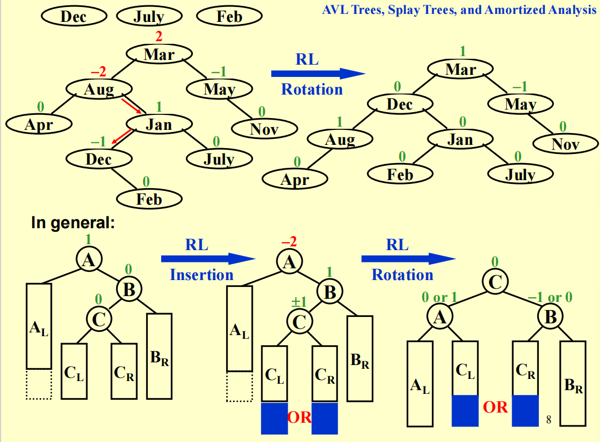
基础方法：将最下面的那个节点(Dec)变成看的最上面的那个，原来的往左走。原来下面的结点直接挂在第二层下面。
### 注意事项
- 在加节点但是没有进行调换的时候也要进行BF的更新
- 也可以用height field来计算，不过每一次都要进行计算
- 挂到第二层的方法是正确的，证明只需要再说明一下大小关系

4. 
证明:AVL树每次查找的时候时间复杂度为O(ln n)
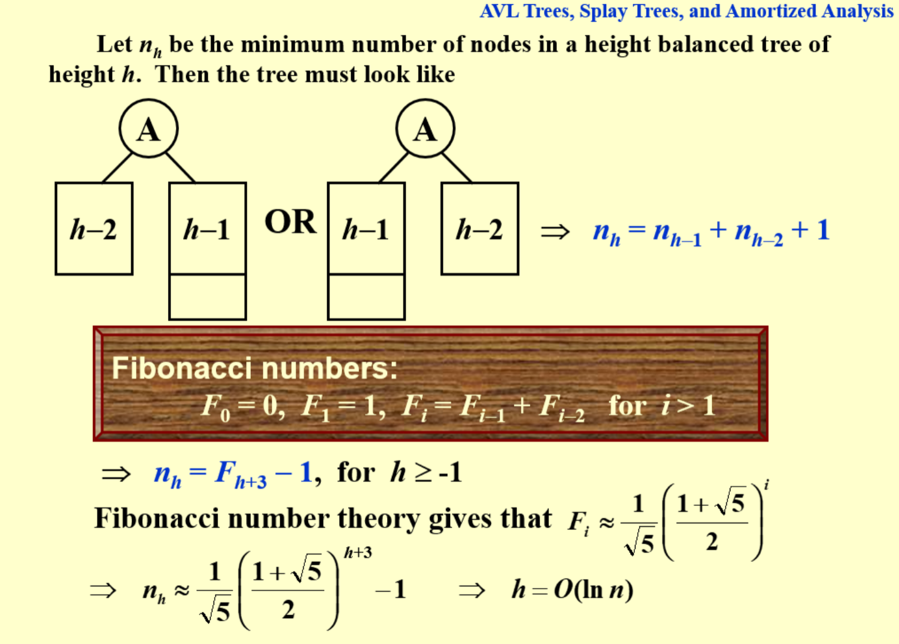
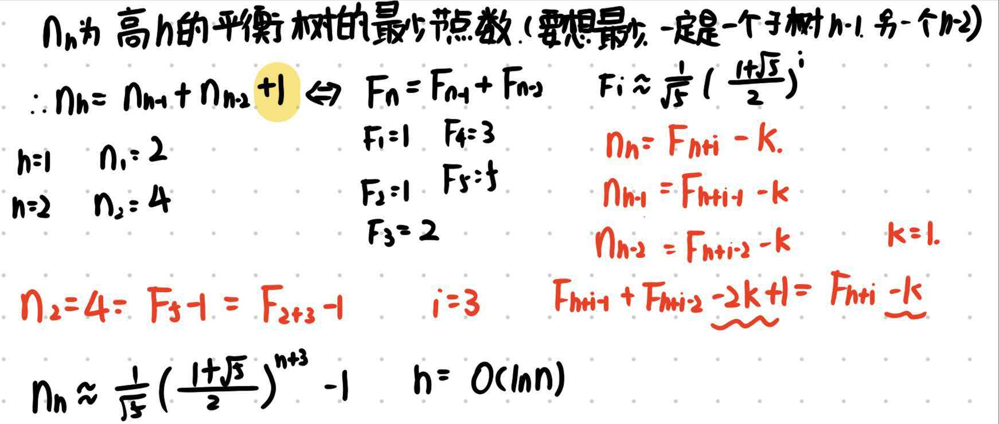

## Splay Trees（）
1. 
背景：为了使任意M个操作总体时间为O(Mlog N)，Amortized time是O(log N)
2. 
做法：要让上一次最坏下一次就最好，上次是O(N)找到的就用AVL旋到根上（旋也有方法注意）

3. 
调整操作：
让选中的节点变为根节点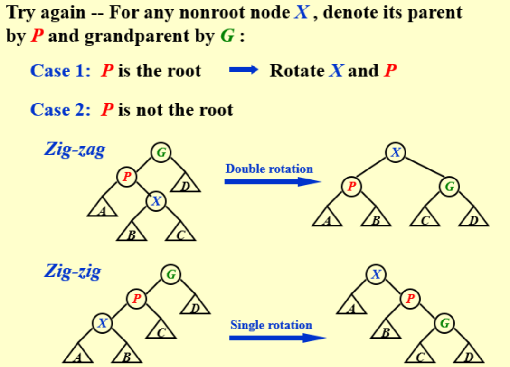
Zig-zag(原来的三个节点方向不一样，之字形，方向相反，转的方向相反)和zig-zig(原来的三个节点方向一样，都向左或向右，一字形，方向相同，转的方向相同)

4. 
删除操作：
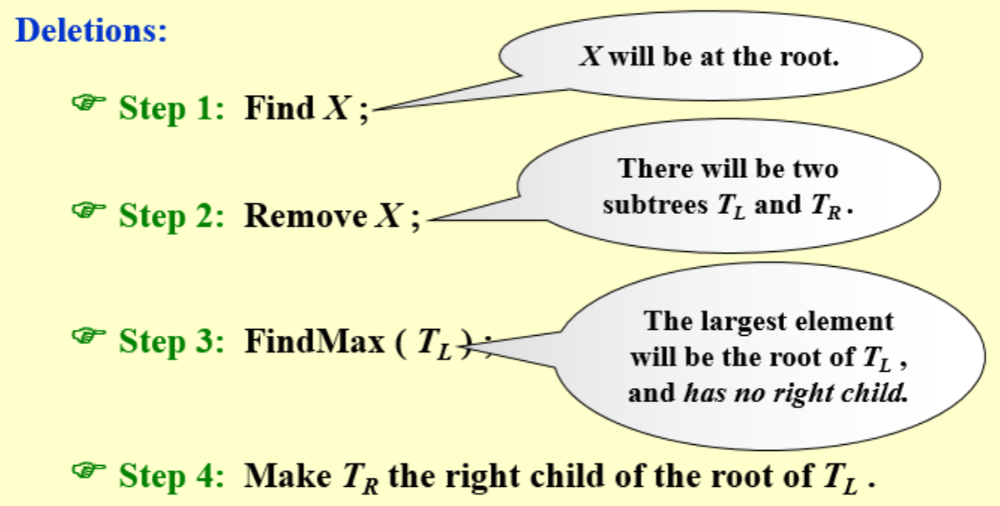

## Amortized Analysis 
> 
摊还时间：连续n次总的真实时间\n的结果
$ worst-case bound \geq amortized bound \geq average-case bound $

方法：
- Aggregate analysis:直接找最坏的情况进行平均
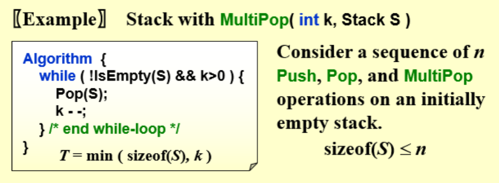
最坏是2n-1，平均是O(1)
- Accounting method:需要去猜平均值进行摊还（类似于在银行存钱）
（银行不能是负的）（这样做，我们可以保证我们得到的这个$\hat{c}_i$比，需要找到比较合适的函数，合适的话就能出结果）
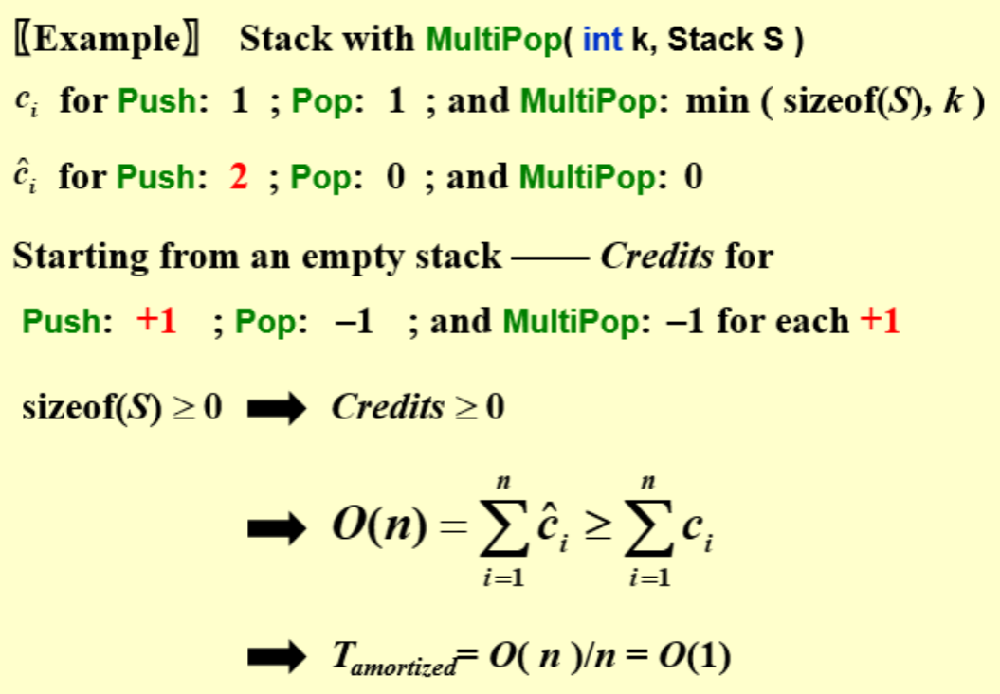

- Potential method:
对credit进行讨论，给出Potential function
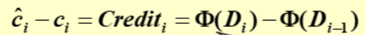
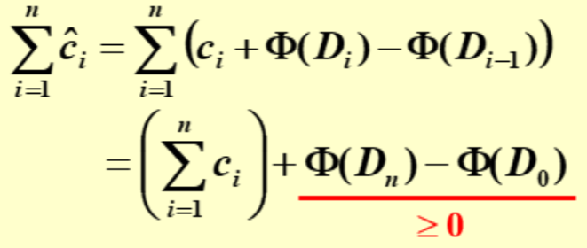
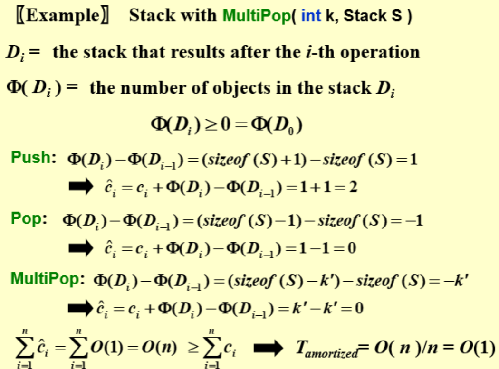

### 用Potential method来证明Amortized time成立
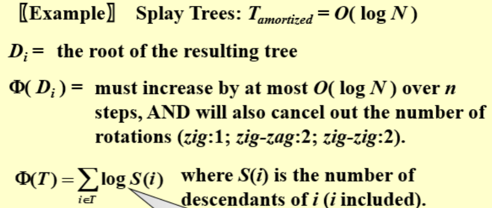
\(\Phi(D_i)\)在n步操作中，最多增加O(logN)，并且还要抵消掉旋转的次数
\(\Phi(T)\)可以表示树高（此时的树高和比较平衡的树的高度相差常数）
不能直接用树高：
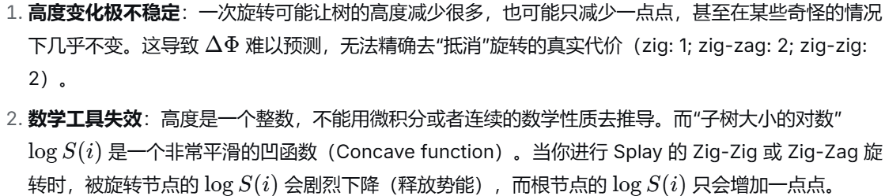

推导：
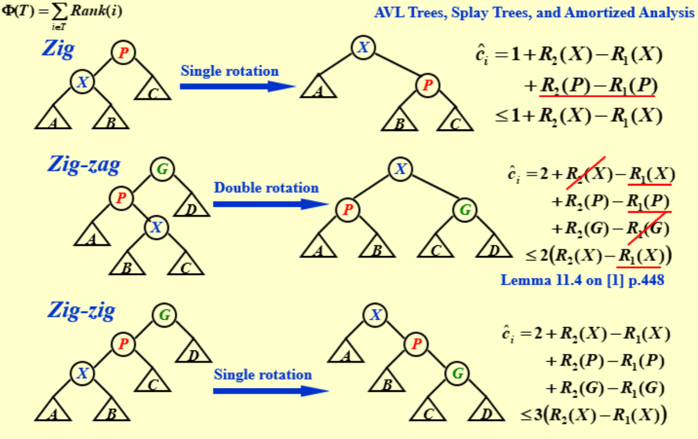
Zig:因为$ R_2(X)-R_1(X) \leq 0 $，所以可以直接变成$ \leq $消掉
Zig-zag:$ R_2(X)-R_1(G) $正好为0，观察得到$ R_1(P) \geq R_1(X) $,把$ R_1(P) $放缩成$ R_1(X) $。符号是$ \leq $，成立。操作后P和G是X的两个子树，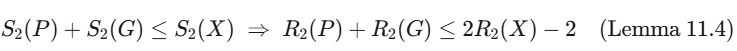。最后得到结果
S和R之间变换的式子的证明：
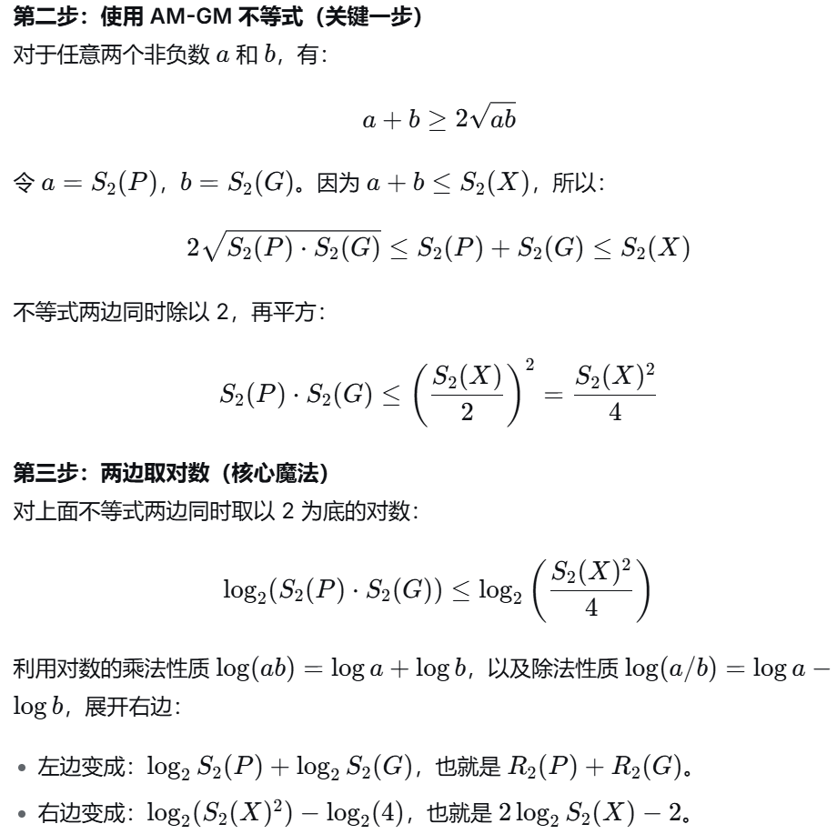

Zig-zig:前两步与上面的相同，
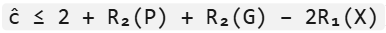
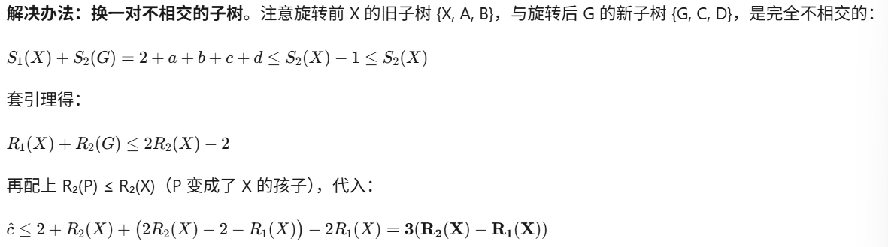

最终结论为：$\hat{c}_i \leq 1+3(R_2(X)-R_1(X))$
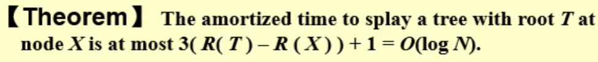

### 注意事项：

练习题见平板笔记